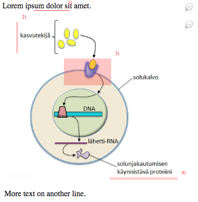

# Answer annotation

Utils for annotating answers for Finnish Matriculation Examination Board.

There are two separate builds:

* `dist`: ES2017 code, ES modules
* `dist/umd`: ES5 code, UMD bundles

# Tests & playground

http://digabi.github.io/answer-annotation/test/static-test.html

# Change log

https://github.com/digabi/answer-annotation/releases

# License

This work is double licensed under:
 * [GPL v3](https://www.gnu.org/licenses/gpl-3.0.en.html)
 * [The MIT License](https://opensource.org/licenses/MIT)
